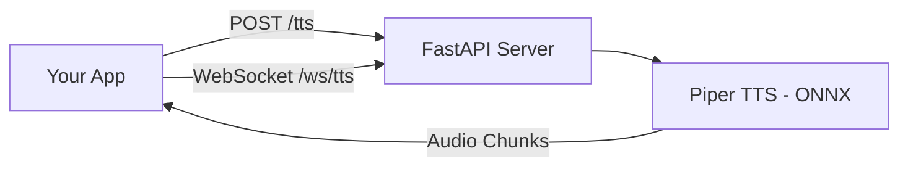

# TTS API

A production-ready Text-to-Speech (TTS) API built with FastAPI and Piper, supporting **streaming audio** for real-time voice applications.

## Features

- 🎯 **Multiple Output Modes**: Base64, Raw PCM streaming, WebSocket, SSE
- 🌍 **Multi-language**: English and Hindi support
- ⚡ **Low Latency**: Streaming audio chunks for real-time playback
- 🔌 **Easy Integration**: Works with Next.js, React, or any frontend

## Architecture



## Installation

1. Clone or download this repository
2. Install dependencies:
   ```bash
   pip install -r requirements.txt
   ```
3. Download voice models (if not already present):
   - Place English model in `English/` folder (`model.onnx` + `model.onnx.json`)
   - Place Hindi model in `Hindi/` folder (`model.onnx` + `model.onnx.json`)
   - Download voices: `python -m piper.download_voices <voice-name>`

## Running the Server

```bash
# Basic server
uvicorn server:app --reload --port 8000

# Streaming server (recommended)
uvicorn server_streaming:app --reload --port 8000
```

API available at `http://localhost:8000`

---

## API Endpoints

### GET `/`
Check server status and available endpoints.

```bash
curl http://localhost:8000/
```

**Response:**
```json
{
  "status": "running",
  "endpoints": {
    "/tts": "Original base64 response",
    "/tts/stream": "Streaming PCM response",
    "/tts/sse": "Server-Sent Events streaming",
    "/ws/tts": "WebSocket for real-time LLM→TTS"
  },
  "audio_config": {
    "sample_rate": 22050,
    "channels": 1,
    "sample_width": 2,
    "format": "PCM 16-bit signed little-endian"
  }
}
```

---

### POST `/tts` - Base64 Response (Simple)

Best for: Simple integrations, testing, small audio files.

**Request:**
```bash
curl -X POST "http://localhost:8000/tts" \
  -H "Content-Type: application/json" \
  -d '{"text": "Hello, how are you?", "language": "english"}'
```

**Response:**
```json
{
  "audio_base64": "UklGRvQ7AABXQVZFZm10IBAAAA..."
}
```

**How to use the response:**

```javascript
// JavaScript - Play in browser
const response = await fetch('/tts', {
  method: 'POST',
  headers: { 'Content-Type': 'application/json' },
  body: JSON.stringify({ text: 'Hello', language: 'english' })
});
const { audio_base64 } = await response.json();

const audio = new Audio(`data:audio/wav;base64,${audio_base64}`);
audio.play();
```

```python
# Python - Save to file
import base64
import requests

response = requests.post('http://localhost:8000/tts', json={
    'text': 'Hello, how are you?',
    'language': 'english'
})
audio_bytes = base64.b64decode(response.json()['audio_base64'])

with open('output.wav', 'wb') as f:
    f.write(audio_bytes)
```

---

### POST `/tts/stream` - Raw PCM Streaming (Recommended)

Best for: Real-time playback, low latency, production apps.

**Request:**
```bash
curl -X POST "http://localhost:8000/tts/stream" \
  -H "Content-Type: application/json" \
  -d '{"text": "Hello, this is streaming audio", "language": "english"}' \
  --output audio.pcm
```

**Response:** Raw PCM bytes (16-bit, 22050Hz, mono)

**Response Headers:**
- `X-Sample-Rate: 22050`
- `X-Channels: 1`
- `X-Sample-Width: 2`

**How to use - JavaScript (Web Audio API):**

```javascript
async function playStreamingAudio(text, language = 'english') {
  const response = await fetch('http://localhost:8000/tts/stream', {
    method: 'POST',
    headers: { 'Content-Type': 'application/json' },
    body: JSON.stringify({ text, language })
  });

  const audioContext = new AudioContext({ sampleRate: 22050 });
  const reader = response.body.getReader();
  let nextStartTime = audioContext.currentTime;

  while (true) {
    const { done, value } = await reader.read();
    if (done) break;

    // Convert PCM to Float32
    const int16Array = new Int16Array(value.buffer);
    const float32Array = new Float32Array(int16Array.length);
    for (let i = 0; i < int16Array.length; i++) {
      float32Array[i] = int16Array[i] / 32768;
    }

    // Create and play buffer
    const audioBuffer = audioContext.createBuffer(1, float32Array.length, 22050);
    audioBuffer.getChannelData(0).set(float32Array);

    const source = audioContext.createBufferSource();
    source.buffer = audioBuffer;
    source.connect(audioContext.destination);
    source.start(nextStartTime);
    
    nextStartTime += audioBuffer.duration;
  }
}

// Usage
playStreamingAudio("Hello, this plays while downloading!");
```

**How to use - Python (Save PCM):**

```python
import requests
import wave

response = requests.post('http://localhost:8000/tts/stream', 
    json={'text': 'Hello streaming', 'language': 'english'},
    stream=True
)

# Save as WAV
with wave.open('output.wav', 'wb') as wav:
    wav.setnchannels(1)
    wav.setsampwidth(2)
    wav.setframerate(22050)
    for chunk in response.iter_content(chunk_size=4096):
        wav.writeframes(chunk)
```

---

### WebSocket `/ws/tts` - Real-time LLM Integration

Best for: Voice assistants, LLM streaming → TTS, real-time apps.

**How it works:**
1. Connect to WebSocket
2. Send text chunks (from LLM tokens)
3. Receive audio chunks in real-time
4. Play audio while receiving more

**Protocol:**

```
Client → Server: {"text": "Hello, ", "language": "english", "is_final": false}
Server → Client: <binary audio chunk>
Server → Client: <binary audio chunk>

Client → Server: {"text": "how are you?", "language": "english", "is_final": true}
Server → Client: <binary audio chunk>
Server → Client: <connection closed>
```

**JavaScript Example:**

```javascript
class TTSWebSocket {
  constructor(url = 'ws://localhost:8000/ws/tts') {
    this.url = url;
    this.audioContext = null;
    this.nextStartTime = 0;
  }

  async connect() {
    this.audioContext = new AudioContext({ sampleRate: 22050 });
    this.nextStartTime = this.audioContext.currentTime;

    return new Promise((resolve, reject) => {
      this.ws = new WebSocket(this.url);
      this.ws.binaryType = 'arraybuffer';
      
      this.ws.onopen = () => resolve();
      this.ws.onerror = () => reject(new Error('WebSocket error'));
      
      this.ws.onmessage = (event) => {
        if (event.data instanceof ArrayBuffer) {
          this.playChunk(event.data);
        }
      };
    });
  }

  playChunk(pcmData) {
    const int16Array = new Int16Array(pcmData);
    const float32Array = new Float32Array(int16Array.length);
    for (let i = 0; i < int16Array.length; i++) {
      float32Array[i] = int16Array[i] / 32768;
    }

    const buffer = this.audioContext.createBuffer(1, float32Array.length, 22050);
    buffer.getChannelData(0).set(float32Array);

    const source = this.audioContext.createBufferSource();
    source.buffer = buffer;
    source.connect(this.audioContext.destination);
    
    const startTime = Math.max(this.nextStartTime, this.audioContext.currentTime);
    source.start(startTime);
    this.nextStartTime = startTime + buffer.duration;
  }

  // Call this as you receive tokens from LLM
  sendText(text, isFinal = false) {
    if (this.ws?.readyState === WebSocket.OPEN) {
      this.ws.send(JSON.stringify({
        text,
        language: 'english',
        is_final: isFinal
      }));
    }
  }

  close() {
    this.ws?.close();
    this.audioContext?.close();
  }
}

// Usage with LLM streaming
const tts = new TTSWebSocket();
await tts.connect();

// As you receive LLM tokens:
tts.sendText("Sure, ");
tts.sendText("let me explain. ");
tts.sendText("Here's how it works.", true); // Final chunk
```

---

### POST `/tts/sse` - Server-Sent Events

Best for: When WebSocket is overkill, but you want streaming.

**Request:**
```bash
curl -X POST "http://localhost:8000/tts/sse" \
  -H "Content-Type: application/json" \
  -d '{"text": "Hello SSE", "language": "english"}'
```

**Response (SSE stream):**
```
data: {"type": "config", "sampleRate": 22050, "channels": 1}

data: {"type": "audio", "chunk": "base64encodedchunk...", "index": 0}

data: {"type": "audio", "chunk": "base64encodedchunk...", "index": 1}

data: {"type": "done"}
```

**JavaScript Example:**

```javascript
async function playSSE(text) {
  const response = await fetch('http://localhost:8000/tts/sse', {
    method: 'POST',
    headers: { 'Content-Type': 'application/json' },
    body: JSON.stringify({ text, language: 'english' })
  });

  const reader = response.body.getReader();
  const decoder = new TextDecoder();
  const audioContext = new AudioContext({ sampleRate: 22050 });
  let nextStartTime = audioContext.currentTime;
  let buffer = '';

  while (true) {
    const { done, value } = await reader.read();
    if (done) break;

    buffer += decoder.decode(value, { stream: true });
    const lines = buffer.split('\n\n');
    buffer = lines.pop();

    for (const line of lines) {
      if (!line.startsWith('data: ')) continue;
      const data = JSON.parse(line.slice(6));

      if (data.type === 'audio') {
        // Decode base64 and play
        const bytes = Uint8Array.from(atob(data.chunk), c => c.charCodeAt(0));
        const int16 = new Int16Array(bytes.buffer);
        const float32 = new Float32Array(int16.length);
        for (let i = 0; i < int16.length; i++) {
          float32[i] = int16[i] / 32768;
        }

        const audioBuffer = audioContext.createBuffer(1, float32.length, 22050);
        audioBuffer.getChannelData(0).set(float32);

        const source = audioContext.createBufferSource();
        source.buffer = audioBuffer;
        source.connect(audioContext.destination);
        source.start(nextStartTime);
        nextStartTime += audioBuffer.duration;
      }
    }
  }
}
```

---

## Which Endpoint Should I Use?

| Use Case | Endpoint | Why |
|----------|----------|-----|
| Quick test / Postman | `/tts` | Simple JSON response |
| Save audio to file | `/tts` | Easy to decode base64 |
| Real-time playback | `/tts/stream` | Low latency, efficient |
| Voice assistant / chatbot | `/ws/tts` | Best for LLM integration |
| Simple streaming | `/tts/sse` | Easier than WebSocket |

---

## Next.js Integration

See the `nextjs-integration/` folder for:
- `voice-pipeline.ts` - Audio player utilities
- `api-route-example.ts` - Next.js API route for LLM → TTS
- `use-voice-chat.tsx` - React hook for voice chat
- `ARCHITECTURE.md` - Full architecture diagram

**Quick example:**

```tsx
// In your React component
import { useVoiceChat } from './use-voice-chat';

function VoiceApp() {
  const { sendMessage, transcript, isPlaying, stop } = useVoiceChat({
    apiEndpoint: '/api/voice-chat',
    language: 'english'
  });

  return (
    <div>
      <button onClick={() => sendMessage("Tell me a joke")}>
        {isPlaying ? "🔊 Speaking..." : "🎤 Ask"}
      </button>
      {isPlaying && <button onClick={stop}>Stop</button>}
      <p>{transcript}</p>
    </div>
  );
}
```

---

## Audio Format Reference

| Property | Value |
|----------|-------|
| Sample Rate | 22050 Hz |
| Channels | 1 (Mono) |
| Bit Depth | 16-bit |
| Format | PCM signed little-endian |
| Encoding | WAV (base64) or raw PCM |

---

## Troubleshooting

**"No audio plays"**
- Check browser console for AudioContext errors
- User interaction required before AudioContext can start
- Wrap `audioContext.resume()` in a click handler

**"Audio is choppy"**
- Increase chunk size in your buffer
- Use `/tts/stream` instead of `/tts` for longer text
- Check network latency

**"WebSocket closes immediately"**
- Ensure you're sending `is_final: true` on last chunk
- Check server logs for errors

---

## License

MIT License. See [LICENSE](LICENSE) for details.</content>