# Streaming Voice Architecture

## The Correct Mental Model

```
❌ WRONG: word → TTS → play → word → TTS → play
✅ RIGHT: [token stream] → [chunk buffer] → [TTS] → [audio queue] → [continuous playback]
```

## Your Architecture

```mermaid
graph TD
    subgraph Frontend["Frontend - Next.js"]
        A[🎤 Microphone] --> B[STT - 3rd Party API]
        B --> C[User Text]
        C --> D[Next.js API Route<br>/api/voice-chat]
    end

    subgraph Backend["Backend - Next.js API"]
        D --> E[Gemini LLM<br>Streaming Tokens]
        E --> F[Token Chunker]
        F --> G{Complete Phrase<br>Detected?}
        G -->|Yes| H[Python FastAPI TTS<br>localhost:8000]
    end

    subgraph TTS["TTS Service - FastAPI"]
        H --> I[Piper TTS Model<br>ONNX]
        I --> J["tts/stream - Raw PCM"]
        I --> K["ws/tts - WebSocket"]
    end

    subgraph Playback["Audio Playback"]
        J --> L[Audio Chunks]
        K --> L
        L --> M[Web Audio API]
        M --> N[AudioContext]
        N --> O[Buffer Queue]
        O --> P[🔊 Speakers]
    end

    style Frontend fill:#e1f5fe
    style Backend fill:#fff3e0
    style TTS fill:#f3e5f5
    style Playback fill:#e8f5e9
```



### Data Flow Summary

```mermaid
graph LR
    A[🎤 Mic] -->|Audio Stream| B[STT]
    B -->|Text| C[LLM]
    C -->|Token Stream| D[Chunker]
    D -->|Phrases| E[TTS]
    E -->|PCM Audio| F[Buffer]
    F -->|Continuous| G[🔊 Play]
```



## Key Principles

### 1. Stream Everything
- STT: partial → final transcripts
- LLM: token by token
- TTS: chunk by chunk
- Audio: continuous buffer

### 2. Intelligent Chunking
```
"Sure, let's break this down. First, here's how it works."
       ↓
Chunk 1: "Sure, let's break this down."
Chunk 2: "First, here's how it works."
```

NOT:
```
"Sure" → TTS → "," → TTS → " let's" → TTS  // WRONG
```

### 3. Audio Buffer Queue
```javascript
// Frontend maintains a queue
audioQueue = [chunk1, chunk2, chunk3...]

// Playback is scheduled continuously
nextStartTime = currentTime + previousDuration
source.start(nextStartTime)
```

### 4. No Base64 in Production
```
Base64: +33% size, slower decode
Raw PCM: Direct, efficient
```

## Files Created

| File | Purpose |
|------|---------|
| `server_streaming.py` | FastAPI with streaming endpoints |
| `voice-pipeline.ts` | Frontend audio utilities |
| `api-route-example.ts` | Next.js API route |
| `use-voice-chat.tsx` | React hook for voice chat |

## Quick Start

### 1. Run TTS Server
```bash
cd h:\tts-api
python server_streaming.py
```

### 2. In Next.js
```tsx
// app/api/voice-chat/route.ts
// Copy from api-route-example.ts

// In your component
import { useVoiceChat } from './use-voice-chat';

function VoiceApp() {
  const { sendMessage, transcript, isPlaying } = useVoiceChat();
  
  return (
    <button onClick={() => sendMessage("Hello!")}>
      {isPlaying ? "Speaking..." : "Talk"}
    </button>
  );
}
```

## Latency Targets

| Stage | Target | How |
|-------|--------|-----|
| STT | <200ms | Streaming STT API |
| LLM First Token | <300ms | Gemini streaming |
| TTS First Chunk | <150ms | Piper is fast |
| **Total to First Audio** | **<650ms** | Streaming everything |

## Why This Works

1. **Piper TTS is fast** - ONNX model, ~50ms per sentence
2. **Chunking at phrase boundaries** - Natural prosody, no robot voice
3. **Web Audio buffer queue** - Gapless playback
4. **Streaming all the way** - No waiting for completion

## Common Mistakes to Avoid

| Mistake | Why It's Bad | Fix |
|---------|--------------|-----|
| TTS per word | Latency, bad prosody | Chunk by sentence |
| Wait for full LLM response | Huge delay | Stream tokens |
| `<audio src={url}>` | Can't stream | Web Audio API |
| Base64 everywhere | 33% overhead | Raw PCM/ArrayBuffer |
| HTTP polling | Latency | WebSocket/SSE |
